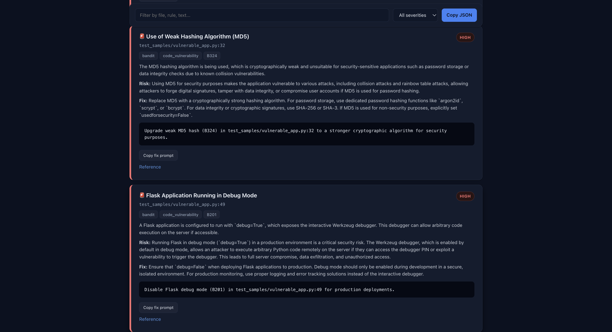
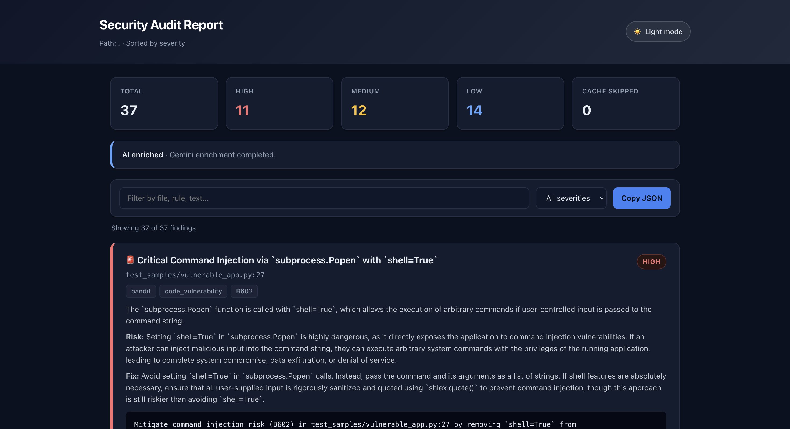

# AI Code Auditor

<p align="center">         </p>

**A drop-in security scanner for GitHub Actions.** Runs static analysis, secret detection, and dependency auditing across your whole codebase - Python, JavaScript, Go, C/C++, and more - with AI-enriched findings and a searchable, filterable HTML report you can share with a link.

Add one line to your workflow. Get a real security report on every push and pull request.

```yaml
- uses: maorVakn/ai_code_auditor@v1
  with:
    gemini-api-key: ${{ secrets.GEMINI_API_KEY }}
```

---

## Table of contents

- [Why this exists](#why-this-exists)
- [What it finds](#what-it-finds)
- [Screenshots](#screenshots)
- [Quick start](#quick-start)
- [Inputs](#inputs)
- [Outputs](#outputs)
- [How it works](#how-it-works)
- [The report](#the-report)
- [Publishing to GitHub Pages](#publishing-to-github-pages)
- [Configuration reference](#configuration-reference)
- [Security notes](#security-notes)
- [Known limitations](#known-limitations)
- [Contributing](#contributing)
- [License](#license)

---

## Why this exists

Most security scanning setups mean picking three or four separate tools, wiring each one into CI by hand, figuring out where the reports go, and hoping someone actually opens the artifact zip to read them. AI Code Auditor packages that whole pipeline into a single GitHub Action: multiple scanners run in parallel, results are merged into one consistent format, optionally enriched by an LLM for clearer summaries and fix suggestions, and published as a report anyone on the team can open with one click - no downloads, no setup beyond adding the action to your workflow.

It's built to be dropped into **any** repository, public or private, regardless of what language the code is written in.

There's also a more personal reason this project exists. A lot of developers, especially early in their careers, never get real feedback on the security quality of their code - no one on the team has the time, or there is no team yet. A tool like this acts as that missing reviewer: it flags risky patterns (unsafe deserialization, command injection, weak crypto, and so on) the same way a security-conscious senior engineer would, on every single push, for free.

It also catches the kind of mistake that's easy to make in good faith and expensive to walk back. It's not unusual for a hardcoded API key, a leftover debug flag, or a stray password to slip into a commit, get merged, and end up live in production before anyone notices - sometimes it's caught during a routine merge or rebase to production, sometimes it isn't caught at all until something goes wrong. This is especially unforgiving on an **open-source** project: once a secret is pushed to a public repository, it's effectively public forever, history rewrite or not, and it's very likely to be found by automated scrapers within minutes.

The goal is for repeated exposure to these findings to change habits, not just clean up individual commits - so that hardcoding a credential, trusting unsanitized input, or reaching for `eval()` starts to feel wrong before the scanner even has to say so.

## What it finds

| Tool | Scope | Detects |
|---|---|---|
| **Bandit** | Python files | Command injection, unsafe deserialization, weak crypto, `eval()`/`exec()` misuse, insecure defaults, and more |
| **Semgrep** | Every other file type (JS/TS, Go, Java, C/C++, Ruby, PHP, YAML, and more) | The same class of code-level vulnerabilities as Bandit, using community-maintained rulesets that update automatically |
| **detect-secrets** | All files | Hardcoded credentials: API keys, tokens, AWS keys, high-entropy strings, and known secret patterns |
| **pip-audit** | `requirements.txt` | Known CVEs in your Python dependencies, checked against the [osv.dev](https://osv.dev) database |

Bandit and Semgrep never overlap - Bandit owns Python exclusively, Semgrep owns everything else - so the same issue is never reported twice by two different tools.

## Screenshots





## Quick start

1. Add this file at `.github/workflows/security-scan.yml` in your repository:

   ```yaml
   name: Security scan

   on:
     push:
       branches-ignore: [gh-pages]
     pull_request:
     workflow_dispatch:

   permissions:
     contents: write        # only needed if you want auto-publish to GitHub Pages
     pull-requests: write    # only needed for the PR comment with the report link

   jobs:
     scan:
       runs-on: ubuntu-latest
       steps:
         - uses: actions/checkout@v4

         - uses: maorVakn/ai_code_auditor@v1
           with:
             gemini-api-key: ${{ secrets.GEMINI_API_KEY }}   # optional
   ```

2. *(Optional)* Add a `GEMINI_API_KEY` secret under **Settings → Secrets and variables → Actions** if you want AI-enriched summaries and fix suggestions. Without it, the tool still works - it falls back to a clear, deterministic report.

3. Push a commit or open a pull request. The scan runs automatically.

4. If your repo is public, the interactive report gets published to GitHub Pages and linked directly in the workflow summary and in a PR comment - the first time, you'll need to enable Pages once under **Settings → Pages → Source → Deploy from a branch → `gh-pages`**.

That's it. No Python setup, no dependency installation, no separate config file to maintain.

## Inputs

| Name | Description | Default |
|---|---|---|
| `code-path` | Path (relative to your repo root) to scan | `.` |
| `requirements-path` | Path to `requirements.txt`, if not at the default location | auto-detected |
| `gemini-api-key` | Gemini API key for AI-enriched findings | *(none - falls back to deterministic report)* |
| `fail-on-high` | Fail the step if any HIGH severity finding is present | `true` |
| `publish-report` | `true`, `false`, or `auto` (publish only if the repo is public) | `auto` |

## Outputs

| Name | Description |
|---|---|
| `high-count` | Number of HIGH severity findings |
| `report-url` | Public URL of the published report, if published |

## How it works

1. **Collect** every file in the repo (skipping `.git`, `venv`, `node_modules`, and similar noise directories).
2. **Check the cache** - a content hash of every file is compared against the last run. Unchanged files are skipped entirely; only new or modified files are actually scanned. This matters most in CI: a PR touching one file out of a hundred doesn't re-scan the other ninety-nine.
3. **Split by language** - `.py` files go to Bandit, everything else goes to Semgrep, all files go to detect-secrets, and `requirements.txt` goes to pip-audit.
4. **Scan concurrently** - each tool runs in its own thread. Since each one mostly waits on a subprocess (I/O), this is the classic case where Python threads help despite the GIL.
5. **Merge and redact** - results are combined into one consistent schema, and any sensitive value a tool might have echoed back (a matched secret, a credential in a code snippet) is scrubbed before anything is written to disk or sent anywhere.
6. **Enrich (optional)** - if a Gemini API key is configured, findings are sent in small batches for clearer titles, summaries, and fix suggestions. If a batch fails or no key is set, that batch (or the whole report) falls back to the deterministic version - nothing is ever blocked on the AI step.
7. **Report** - an interactive HTML report, a GitHub Actions step summary, and a machine-readable JSON report are all generated from the same data.

## The report

The HTML report is fully self-contained (one file, no build step) and includes:

- **Severity breakdown** at a glance (High / Medium / Low counts)
- **Free-text and severity filtering** across all findings
- **Light and dark mode**, respecting your system preference by default
- **One-click copy** of a ready-to-paste fix prompt for each finding, for pasting directly into an AI coding assistant
- Direct links to reference material for each rule

## Publishing to GitHub Pages

When `publish-report` resolves to `true` (the default `auto` setting does this only for public repos), the report is published under a path specific to what triggered the run:

- Pull requests → `reports/pr-<number>/` (updated on every push to that PR)
- Pushes or manual runs → `reports/branch-<branch-name>/` (one stable link per branch)

A redirect is also published at the site root, so `https://<owner>.github.io/<repo>/` always points at the most recently published report.

> **Note on private repositories:** a GitHub Pages site created from a private repo is publicly visible on the internet unless your organization has GitHub Enterprise Cloud. For that reason, `publish-report: auto` never publishes for private repos by default - the report stays available as a downloadable workflow artifact instead. You can override this with `publish-report: true` if you understand the trade-off.

## Configuration reference

- **`GEMINI_API_KEY`** (secret, optional) - enables AI-enriched findings. Requests are sent in small chunks with retries and automatic fallback across model versions.
- **Cache file** - `.audit_cache.json`, written to the repo root. Recommended to persist it between runs using `actions/cache`, keyed per branch, so cache from one branch never gets served for another.
- **Workflow permissions** - if you want auto-publishing or PR comments, your repository's **Settings → Actions → General → Workflow permissions** must allow "Read and write permissions" - the `permissions:` block in your workflow YAML only *requests* access, it doesn't grant it.

## Security notes

- Detected secrets are **never** written to the cache or the report in raw form - only their location and rule are recorded.
- The scanner never modifies your code; it only reads files and produces reports.
- Findings sent for AI enrichment are the already-redacted version - no raw secret values are ever sent to Gemini.

## Known limitations

- `detect-secrets` scans the current state of files only - it does not scan git history. A secret committed and later removed will not be caught. Tools like `gitleaks` or `trufflehog`, which scan full history, are a good complement.
- Language coverage depends on Semgrep's ruleset quality for that language, which varies.
- This project is under active development - contributions and issue reports are welcome.

## Contributing

Issues and pull requests are welcome. Please open an issue to discuss significant changes before submitting a PR.

## License

*(TBD)*